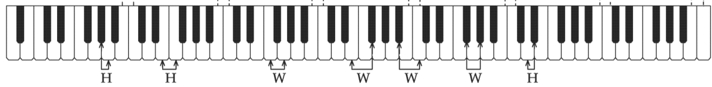

# Pitches
> [!DANGER] Definition: Pitch
> A **pitch** is a sound wave with a particular frequency.

> [!DANGER] Definition: Pitch Class
> A **pitch class** is the set of all pitches separated by a whole number of octaves.
> > [!NOTE]
> > The pitches of a given pitch class sound very similar to one another and are thus assigned the same note designations.

# Intervals
> [!DANGER] Definition: Interval
> An **interval** is the distance between any two pitches.

> [!DANGER] Definition: Octave
> An **octave** is the interval between any two pitches whose frequencies relate to one another like 2:1.

> [!DANGER] Definition: Half Step
> A **half step** is an interval comprising $\frac{1}{12}$ of an octave.
> > [!NOTE] Note: 12TET
> > A half step is the smallest interval subdivision of the octave in the contemporary 12-Tone Equal Temperament (12TET) tuning system.

> [!DANGER] Definition: Whole Step
> A **whole step** is an interval comprising two half steps or $\frac{1}{6}$ of an octave.

### Types of Intervals
> [!DANGER] Definition: Melodic Interval
> An interval is called **melodic** when it pertains to two pitches sounding consecutively.
> > [!DANGER] Definition: Ascending Interval
> > A melodic interval is called **ascending** when the second pitch is higher than the first.
> 
> > [!DANGER] Definition: Descending Interval
> > A melodic interval is called **descending** when the second pitch is lower than the first.

> [!DANGER] Definition: Harmonic Interval
> An interval is called **harmonic** when it pertains to two pitches sounding at the same time.

### Interval Naming
Depending on the context, the same interval may have a different name.

|Number of Half Steps|Possible Interval Designations|Common Names|Audio|
|:--:|:--:|:--:|:--:|
|0|Perfect Unison (P1), Diminished Second (d2)|||
|1|Minor Second (m2), Augmented Unison (A1)|Semitone, Half Step||
|2|Major Second (M2), Diminished Third (d3)|Tone, Whole Step||
|3|Minor Third (m3), Augmented Second (A2)|||
|4|Major Third (M3), Diminished Fourth (d4)|||
|5|Perfect Fourth (P4), Augmented Third (A3)|||
|6|Augmented Fourth (A4), Diminished Fifth (d5)|Tritone||
|7|Perfect Fifth (P5), Diminished Sixth (d6)|||
|8|Minor Sixth (m6), Augmented Fifth (A5)|||
|9|Major Sixth (M6), Diminished Seventh (d7)|||
|10|Minor Seventh (m7), Augmented Sixth (A6)|||
|11|Major Seventh (M7), Diminished Octave (d8)|||
|12|Perfect Octave (P8), Augmented Seventh (A7)|||
