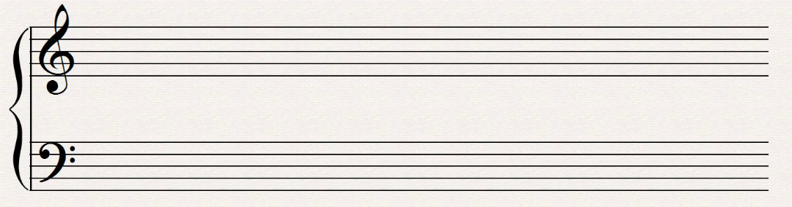

# Pitches
> [!DANGER] Definition: Pitch
> A **pitch** is a sound wave with a particular frequency.

> [!DANGER] Definition: Pitch Class
> A **pitch class** is the set of all pitches separated by a whole number of octaves.
> > [!NOTE]
> > The pitches of a given pitch class sound very similar to one another and are thus assigned the same note designations.

## Staves

> [!DANGER] Definition: Staff
> A **staff** is a row of five lines with four spaces in between which is used for placing notes. 
> > [!NOTE]
> > Each space or line on a staff corresponds to a single note.
>
> > [!DANGER] Definition: Ledger Lines
> > A staff can be extended by **ledger lines** which provide additional lines and spaces to place notes on.

> [!DANGER] Definition: Grand Staff
> A **grand staff** is a combination of two staves used for a single instrument, most commonly the piano.
> 

> [!DANGER] Definition: Bar
> A **bar** is a temporal separation of a staff which always contains the same number of beats.

### Clefs
> [!DANGER] Definition: Clef
> A **clef** is a symbol placed on a staff which assigns a single note to each line and space on the staff.
> 
> 


> [!INFO] The Treble Clef
> 
> ```music-abc
> L: 1/4
> CDEFGABcdefga
> w: C4 D4 E4 F4 G4 A4 B4 C5 D5 E5 F5 G5 A5
> ```
> 
> The first ledger line below the staff is C4.
> 
> The spaces of the staff correspond to the notes D4, F4, A4, C5, E5, G5.
> 
> The lines of the staff correspond to E4, G4, B4, D5, F5.
> 
> The first ledger line above the staff is A5.
> 
> > [!NOTE] The G Clef
> > The treble clef is often called the G clef because it spirals around G4.


> [!INFO] The Bass Clef
> 
> ```music-abc
> K: bass
> L: 1/4
>  E,, F,, G,, A,, B,, C, D, E, F, G, A, B, C|
> w: E2 F2 G2 A2 B2 C3 D3 E3 F3 G3 A3 B3 C4
> ```
> 
> The first ledger line below the staff corresponds to E2.
> 
> The spaces of the staff correspond to F2, A2, C3, E3, G3, B3.
> 
> The lines of the staff correspond to G2, B2, D2, F2, A2.
> 
> The first ledger line above the staff corresponds to C4.
> 
> > [!NOTE] The F Clef
> > The bass clef is often called the F clef because its two dots surround F3.

> [!INFO] The Alto Clef
> 
> ```music-abc
> L: 1/4
> K: clef=alto
> D, E, F, G, A, B, C D E F G A B
> w: D3 E3 F3 G3 A3 B3 C4 D4 E4 F4 G4 A4 B4
> ```
> 
> The first ledger line below the staff corresponds to D3.
> 
> The spaces of the staff correspond to E3, G3, B3, D4, F4, A4.
> 
> The lines of the staff correspond to F3, A3, C4, E4, G4.
> 
> The first ledger line above the staff corresponds to B4.
> 
> > [!NOTE] The C Clef
> > The alto clef is often called the C clef because it is centered at middle C.


### Modifying Pitch

> [!DANGER] Definition: Accidentals
> An **accidental** is a symbol placed before a note which alters the pitch the note represents.
> 
> |Accidental|Name|Function|
> |:--:|:--:|:--:|
> |♯|Sharp|Raises a pitch by a half step.|
> |♭|Flat|Lowers a pitch by a half step.|
> |♮|Natural|Indicates that a pitch is to be played as written (cancels any accidentals).|
> |×|Double Sharp|Raises a pitch by a whole step.|
> |♭♭|Double Flat|Lowers a pitch by a whole step.|
> 
> > [!NOTE]
> > An accidental affects all notes after it which are on the same staff position until another accidental is applied or the measure ends.
> 
> > [!NOTE]
> > Tied notes which cross a barline do not require a new accidental after the barline.
>
> > [!EXAMPLE]- Example
> > 
> > ```music-abc
> > L: 1/4
> > M: 3/4
> > G ^G G | =G _G G-|G ^G =G ||
> >```
> > 
> > The first bar contains the notes (in order): G4 G4# G4#
> > 
> > The second bar contains the notes (in order): G4 G4b G4b
> > 
> > The third bar contains the notes (in order): (tied) G4b G4# G4


# Intervals
> [!DANGER] Definition: Interval
> An **interval** is the distance between any two pitches.

> [!DANGER] Definition: Octave
> An **octave** is the interval between any two pitches whose frequencies relate to one another like 2:1.

> [!DANGER] Definition: Half Step
> A **half step** is an interval comprising $\frac{1}{12}$ of an octave.
> > [!NOTE] Note: 12TET
> > A half step is the smallest interval subdivision of the octave in the contemporary 12-Tone Equal Temperament (12TET) tuning system.

> [!DANGER] Definition: Whole Step
> A **whole step** is an interval comprising two half steps or $\frac{1}{6}$ of an octave.


### Types of Intervals
> [!DANGER] Definition: Melodic Interval
> An interval is called **melodic** when it pertains to two pitches sounding consecutively.
> > [!DANGER] Definition: Ascending Interval
> > A melodic interval is called **ascending** when the second pitch is higher than the first.
> 
> > [!DANGER] Definition: Descending Interval
> > A melodic interval is called **descending** when the second pitch is lower than the first.

> [!DANGER] Definition: Harmonic Interval
> An interval is called **harmonic** when it pertains to two pitches sounding at the same time.

### Interval Naming
Depending on the context, the same interval may have a different name.

|Number of Half Steps|Possible Interval Designations|Common Names|Audio|
|:--:|:--:|:--:|:--:|
|0|Perfect Unison (P1), Diminished Second (d2)|||
|1|Minor Second (m2), Augmented Unison (A1)|Semitone, Half Step||
|2|Major Second (M2), Diminished Third (d3)|Tone, Whole Step||
|3|Minor Third (m3), Augmented Second (A2)|||
|4|Major Third (M3), Diminished Fourth (d4)|||
|5|Perfect Fourth (P4), Augmented Third (A3)|||
|6|Augmented Fourth (A4), Diminished Fifth (d5)|Tritone||
|7|Perfect Fifth (P5), Diminished Sixth (d6)|||
|8|Minor Sixth (m6), Augmented Fifth (A5)|||
|9|Major Sixth (M6), Diminished Seventh (d7)|||
|10|Minor Seventh (m7), Augmented Sixth (A6)|||
|11|Major Seventh (M7), Diminished Octave (d8)|||
|12|Perfect Octave (P8), Augmented Seventh (A7)|||
